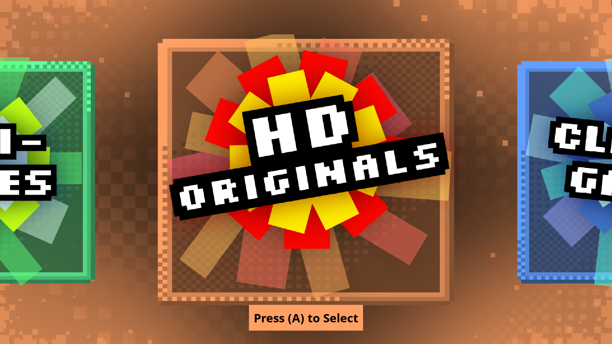
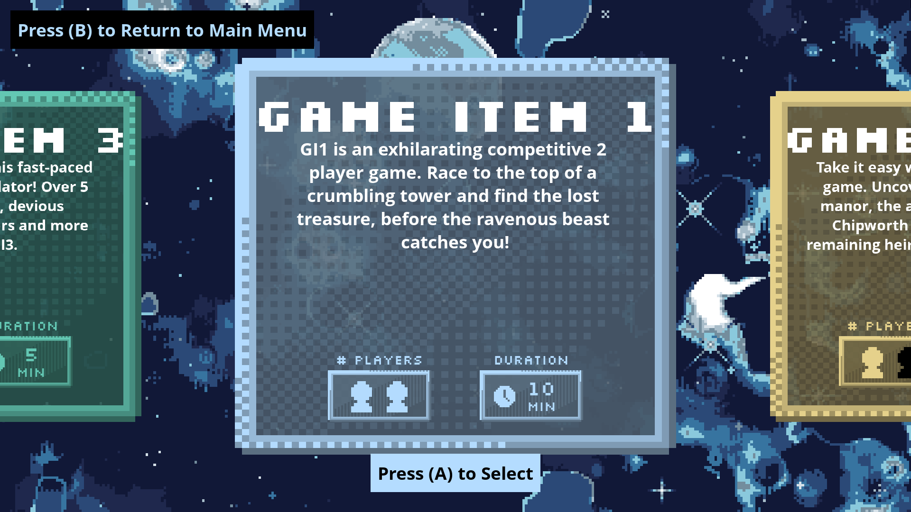

# **HD Arcade Menu** - Grade 12 CS Cumulative Project
## Using PyGame to create an engaging arcade menu system
\
This was my cumulative project for my Grade 12 Computer Science course. Our class was building an arcade system for our school to use. Everyone was tasked with building games in PyGame for students to play on our custom arcade system. I took on the role of designing the menu system that would run and manage games on our system. To create this system, I had to teach myself OOP and file IO independently from our class. Although our class did not end up completing this project, I was very happy with what I learned, what I taught myself, and what I ended up producing!

## Screenshots: 

## Features:
- Responsive to different screen aspect ratios and sizes, manually modifying the UI elements to best fit to the screen.
- Lightweight and adaptive - optimizations were made to reduce computational requirements.
- Intuitive, card based UI based on OOP backend.
- Documented, maintained code (at least Grade 12 me would say so :) )
- Compatible with many different controller inputs (recommended Arcade or generic gamepad, or XBox)
- Limited cross-platform support (recommended for Windows, later would port to Linux)
